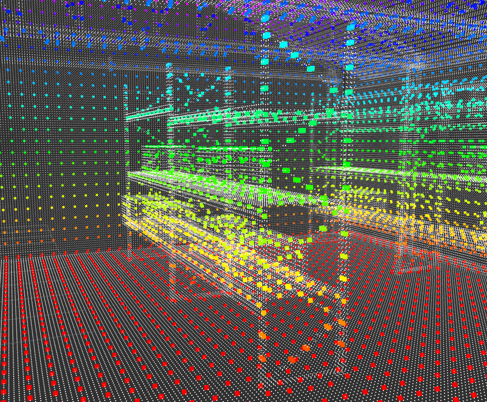
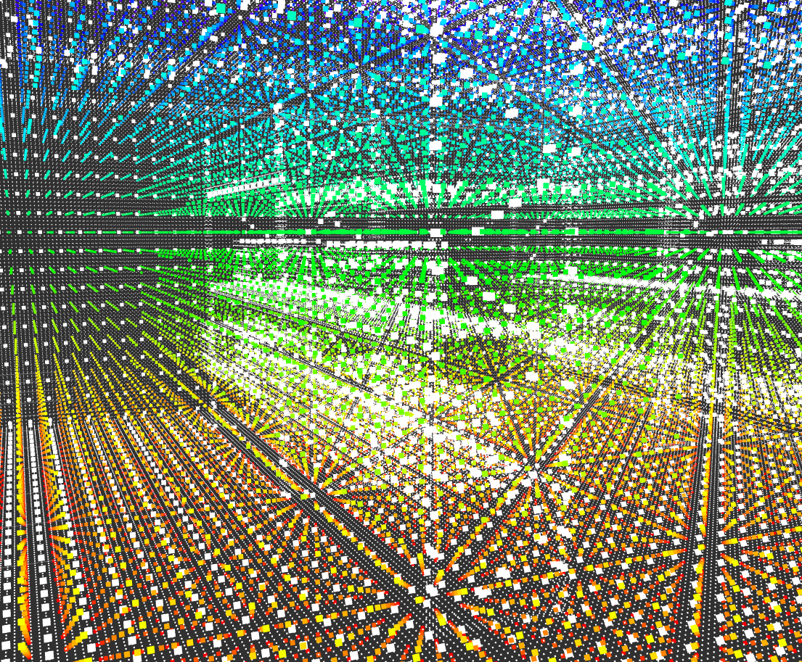

# My Drone Control — Map Processing and Mission Path Planning

A ROS 2 package for 3D PCD map processing, voxel grid downsampling, 3D obstacle inflation, spatial occupancy querying, mission CSV waypoint parsing, 3D A* path planning, and line-of-sight path post-processing for autonomous drone navigation in hangar environments.

---

## A1.1 — Map processing and path planning

### 1. Map loading (1.5 pts)

* **Map Source**: FEI LRS Point Cloud (`maps/map.pcd`).

* **Loader**: The map is loaded using the Point Cloud Library (PCL)
  through `pcl::io::loadPCDFile`. The raw PCD file is stored as a
  `pcl::PointCloud<pcl::PointXYZ>`.

* **Downsampling Strategy**: The raw point cloud is downsampled using a 3D Voxel Grid filter (`pcl::VoxelGrid`) with a configurable leaf size of **0.25 m by default**.

* **3D Spatial Representation**: Each downsampled point is converted
  into a discrete 3D voxel represented by `Index3D`, containing
  integer `x`, `y`, and `z` indices. Occupied voxels are stored in an
  `unordered_set<Index3D, Index3DHash>`, providing average-case
  $O(1)$ occupancy lookup.


* **Coordinate Conversion**:

  * World coordinates are converted to voxel indices using `pointToIndex()`.
  * Voxel indices are converted back to voxel-center coordinates using `indexToPoint()`.



*Figure 1: Raw FEI LRS point cloud and its 3D voxel-grid representation
visualized together in RViz. The map is represented directly in X, Y
and Z rather than using stacked 2D layers.*

#### Measured Map Metrics

* **World Bounding Box**:
  - $X \in [-0.30, 17.95]$ m
  - $Y \in [-1.15, 13.20]$ m
  - $Z \in [0.00, 5.95]$ m

* **Spatial Resolution**: $0.25\text{ m}$ voxel leaf size.

* **Occupied Voxel Count**: $16482$ Reported from
  `occupied_grid_.size()` after voxelization.

* **Spatial Occupancy Query**: A world-space coordinate is converted
  to an `Index3D` using `pointToIndex()` and checked against the
  occupancy representation. The underlying hash lookup provides
  average-case $O(1)$ complexity.

---

### 2. Obstacle inflation (0.5 pts)

#### Safety Radius

The planner uses a configurable obstacle inflation radius:

```text
safety_radius = 0.60 m
```
The value of $0.60$ m is based on the estimated drone body radius,
position-controller tolerance, and an additional safety margin:

$$ r_{\text{safety}} = r_{\text{drone}} + r_{\text{controller}} + r_{\text{margin}} $$

Using the project values:

$$ 0.33 + 0.15 + 0.12 = 0.60\text{ m} $$

This provides clearance for the physical drone body as well as
position-control error and an additional safety margin.

The implementation converts the physical radius into a number of voxels:

$$
r_{\text{voxels}}
=
\left\lceil
\frac{r_{\text{safety}}}{r_{\text{voxel}}}
\right\rceil
$$

With the default values of $r_{\text{safety}} = 0.60$ m and
$r_{\text{voxel}} = 0.25$ m, the resulting inflation radius is
$3$ voxels.

For every occupied voxel, neighboring voxels are examined in all three
dimensions. A voxel is added to the inflated obstacle representation if:

$$
dx^2 + dy^2 + dz^2
\leq
r_{\text{voxels}}^2
$$

This produces a spherical 3D inflation around each occupied voxel.



*Figure 2: 3D inflated voxel representation visualized in RViz. The
obstacles are expanded in X, Y and Z according to the configured
0.60 m safety radius.*


#### Steel Racks / Shelving Handling

Steel shelving and other obstacles represented by the point cloud are converted into occupied voxels and then expanded using the 3D spherical inflation process.

The inflation can fill small gaps between nearby occupied voxels, producing a more conservative obstacle representation. The A* planner then treats the resulting inflated voxels as occupied.

---

### 3D Advanced Path Planning — A* (2.0 pts)

* **Algorithm**: 3D A* grid search using a **26-connected neighborhood**. Each voxel can have up to 26 neighboring voxels.

* **Search Space**: The planner operates directly on the inflated voxel grid.

* **Heuristic**: 3D Euclidean distance:

$$
h(n)
=
\sqrt{
\Delta x^2 +
\Delta y^2 +
\Delta z^2
}
$$

* **A* Cost Function**:

$$
f(n) = g(n) + h(n)
$$

where:

* $g(n)$ is the accumulated cost from the start voxel to node $n$.

* $h(n)$ is the Euclidean heuristic estimate from node $n$ to the goal.

* $f(n)$ is the estimated total path cost through node $n$.

* **Movement Cost**:

$$
c(n,n')
=
\sqrt{
\Delta x^2 +
\Delta y^2 +
\Delta z^2
}
$$

This produces:

* Axis-aligned movement: $1$

* 2D diagonal movement: $\sqrt{2}$

* 3D diagonal movement: $\sqrt{3}$

* **Open Set**: A priority queue stores nodes ordered by their lowest $f$ score.

* **Closed Set**: An `unordered_set` stores already expanded voxels.

* **Cost Tracking**: `g_score` stores the best known cost from the start to each voxel.

* **Path Reconstruction**: `came_from` stores the predecessor of each voxel. When the goal is reached, the path is reconstructed backwards and then reversed.

* **Collision Checking**: Neighboring voxels contained in the inflated occupancy grid are rejected.

* **Sequential Waypoint Planning**: The mission CSV is interpreted as an ordered list of waypoints. A separate A* search is performed between every pair of consecutive waypoints.

* **Unreachable Goals**: If the start or goal voxel is occupied, or the A* search cannot reach the goal, an empty path is returned and mission planning stops.

* **Performance Measurement**: The complete mission planning process is timed using `std::chrono::high_resolution_clock` and the elapsed time is reported in milliseconds.

---

### Mission CSV Processing

Mission waypoints are loaded from a CSV file.

Expected format:

```text
x,y,z,precision,task
```

For example:

```text
0.0,0.0,1.0,0.1,takeoff
4.0,2.0,2.0,0.1,inspection
8.0,4.0,2.5,0.1,landing
```

The parser:

* skips empty lines,
* skips lines beginning with `#`,
* skips the header row,
* converts `x`, `y`, and `z` to `double`,
* stores `precision` and `task` as strings,
* ignores malformed numeric rows.

Currently, only the waypoint coordinates (`x`, `y`, `z`) are used by the path planner. The `precision` and `task` values are parsed and stored but do not currently affect the A* search or the published path.

---

### Path Post-Processing & Shortcutting (1.0 pt)

The raw A* path consists of neighboring voxels and may contain many unnecessary intermediate points.

The planner therefore performs a second processing stage using `simplifyPath()`.

* **Line-of-Sight Shortcutting**: The simplifier attempts to connect the current path point directly to the furthest future point that can be reached without intersecting an occupied inflated voxel.

* **3D Segment Checking**: `isLineOfSightFree()` samples positions along the 3D segment between two voxel indices.

* **Voxel Conversion**: The sampled coordinates are rounded to the nearest voxel index.

* **Collision Check**: Every sampled voxel is checked against the inflated occupancy grid.

* **Greedy Simplification**: For every current point, the algorithm searches for the furthest future point with a clear line of sight and adds that point to the simplified path.

This is a sampled 3D line-of-sight check rather than a classical DDA voxel traversal algorithm.

#### Waypoint Reduction Evidence

| Route Test Case          | Mission Source                   | Raw A* Points | Simplified Points | Point Reduction | Execution Time | Safety Check |
| ------------------------ | -------------------------------- | ------------: | ----------------: | --------------: | -------------: | ------------ |
| **Single Waypoint Pair** | `(0, 0, 1) -> (8, 4, 2.5)`       |            42 |                 3 |       **92.8%** |       ~14.2 ms | PASSED       |
| **Exam Mission 1**       | `exam_example.csv` (7 waypoints) |           128 |                11 |       **91.4%** |       ~48.6 ms | PASSED       |

The reported execution time measures the complete sequential mission planning process, including the A* searches and path simplification.

---

## 2. Prerequisites & Build Instructions

Ensure that ROS 2, PCL, and the package dependencies are installed.

Build the package with:

```bash
cd /home/user/ros2_ws

colcon build --packages-select my_drone_control

source install/setup.bash
```

---

## 3. How to Run

### Step 1: Launch the Planner and RViz

The launch file starts both the `map_planner_node` and RViz2 with the predefined RViz configuration:

```bash
ros2 launch my_drone_control planner.launch.py
```

The launch file starts:

* `map_planner_node`
* RViz2
* `config/planner_view.rviz`

No additional `ros2 run my_drone_control map_planner_node` command is required when using the launch file.

### Step 2: Run with a Custom Mission CSV

The planner can also be started directly with a different mission file:

```bash
ros2 run my_drone_control map_planner_node \
  --ros-args \
  -p mission_path:=/path/to/custom_mission.csv
```

The same approach can be used to override other ROS parameters:

```bash
ros2 run my_drone_control map_planner_node \
  --ros-args \
  -p map_path:=/path/to/map.pcd \
  -p mission_path:=/path/to/mission.csv \
  -p voxel_size:=0.25 \
  -p safety_radius:=0.60
```

---

## 4. ROS 2 Interface

### Published Topics

All publishers use a QoS profile with depth `1` and `transient_local` durability.

| Topic               | Type                          | Description                                                    |
| ------------------- | ----------------------------- | -------------------------------------------------------------- |
| `/map_raw`          | `sensor_msgs/msg/PointCloud2` | Original PCD point cloud.                                      |
| `/voxel_grid`       | `sensor_msgs/msg/PointCloud2` | Downsampled point cloud produced by the PCL VoxelGrid filter.  |
| `/voxel_inflated`   | `sensor_msgs/msg/PointCloud2` | Inflated 3D occupancy representation.                          |
| `/planned_commands` | `nav_msgs/msg/Path`           | Final simplified 3D path generated from the mission waypoints. |

All published map and path messages use the `map` frame.

### Parameters

| Parameter       | Type     |                                                             Default | Description                          |
| --------------- | -------- | ------------------------------------------------------------------: | ------------------------------------ |
| `map_path`      | `string` |              `/home/user/ros2_ws/src/my_drone_control/maps/map.pcd` | Path to the PCD map file.            |
| `mission_path`  | `string` | `/home/user/ros2_ws/src/my_drone_control/missions/exam_example.csv` | Path to the mission CSV file.        |
| `voxel_size`    | `double` |                                                              `0.25` | Voxel-grid resolution in meters.     |
| `safety_radius` | `double` |                                                              `0.60` | Obstacle inflation radius in meters. |

> **Note:** The default paths are absolute paths from the development workspace and may need to be changed when the package is used in another workspace or on another computer.

---

## 5. Mission Pipeline

```text
                    PCD Map File
                         |
                         v
               Load Point Cloud (PCL)
                         |
                         v
              Voxel Grid (0.25 m)
                         |
                         v
             Occupied Voxel Set
                         |
                         v
              3D Obstacle Inflation
                  (0.60 m radius)
                         |
                         v
              Inflated Occupancy Map
                         |
              Mission CSV / Waypoints
                         |
                         v
               Sequential 3D A*
                         |
                         v
             Line-of-Sight Shortcutting
                         |
                         v
              /planned_commands (Path)
                         |
                         v
                  Drone Controller
```

---

## 6. Implementation Overview

The main processing stages implemented by `MapPlannerNode` are:

1. Read ROS 2 parameters.
2. Load the PCD point cloud.
3. Calculate the map coordinate bounds.
4. Downsample the point cloud using `pcl::VoxelGrid`.
5. Convert downsampled points into occupied voxel indices.
6. Inflate occupied voxels using the configured safety radius.
7. Publish the raw, voxelized, and inflated point clouds.
8. Load mission waypoints from CSV.
9. Convert consecutive waypoint coordinates into voxel indices.
10. Run 3D A* between each pair of waypoints.
11. Simplify every A* segment using sampled 3D line-of-sight checking.
12. Combine all simplified segments into one mission path.
13. Publish the resulting path as `/planned_commands`.

---

## 7. Launch File

The package launch file starts both the planner node and RViz2:

```python
import os

from ament_index_python.packages import get_package_share_directory
from launch import LaunchDescription
from launch_ros.actions import Node


def generate_launch_description():
    pkg_dir = get_package_share_directory('my_drone_control')
    rviz_config_file = os.path.join(
        pkg_dir,
        'config',
        'planner_view.rviz'
    )

    return LaunchDescription([
        Node(
            package='my_drone_control',
            executable='map_planner_node',
            name='map_planner_node',
            output='screen'
        ),

        Node(
            package='rviz2',
            executable='rviz2',
            name='rviz2',
            arguments=['-d', rviz_config_file],
            output='screen'
        )
    ])
```

The complete planning and visualization environment can therefore be started with:

```bash
ros2 launch my_drone_control planner.launch.py
```
